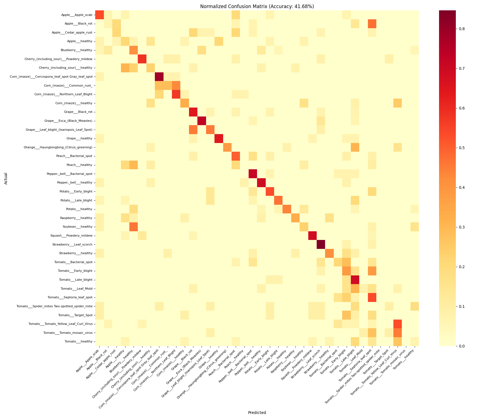

# Plant Disease Detection using EfficientNet

This project implements a deep learning model to detect 38 different types of plant diseases using the PlantVillage dataset. The model is based on the EfficientNet architecture, providing a balance between accuracy and computational efficiency.

## Features
- Detects diseases across various crops (Apple, Corn, Tomato, Potato, etc.).
- Includes 38 distinct classes (diseased and healthy).
- Inference script for single image prediction and full test set evaluation.

## Installation

### Using uv (Recommended)
```bash
uv sync
```
This will install dependencies from `pyproject.toml` and `uv.lock`.

### Using pip
```bash
pip install -r requirements.txt
```

## Project Structure
- `Plant_Disease_Detection.ipynb`: Training and experimentation notebook.
- `inference.py`: Script for single-image prediction and full evaluation.
- `plant_disease_efficientnet.keras`: The trained model file (not included in the repository, download from Hugging Face).
- `class_names.txt`: Mapping of class indices to human-readable names.
- `evaluation_report.md`: Detailed performance metrics and classification report.
- `requirements.txt`: List of Python dependencies.
- `pyproject.toml`: Project metadata and dependency configuration.

## Usage

### Predict a Single Image
```bash
python inference.py
```
Select option `1` and provide the path to your image.

### Run Full Evaluation
```bash
python inference.py
```
Select option `2` to run evaluation on the test directories.

## Evaluation Results

The model was evaluated on a test set of 511 images.

- **Overall Accuracy:** 41.68%

### Classification Report (Summary)
| Metric | Value |
| :--- | :--- |
| Total Images | 511 |
| Correct Predictions | 213 |
| Accuracy | 41.68% |

### Confusion Matrix


## Model Hosting
The trained model is hosted on Hugging Face: [Nefflymicn/PlantVillage-plant-disease-detection](https://huggingface.co/Nefflymicn/PlantVillage-plant-disease-detection)

## License
Apache-2.0
